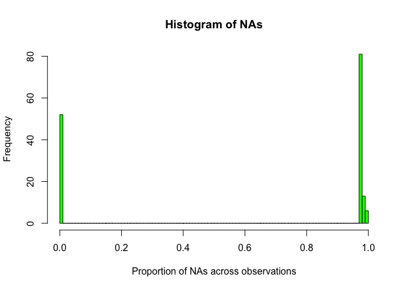
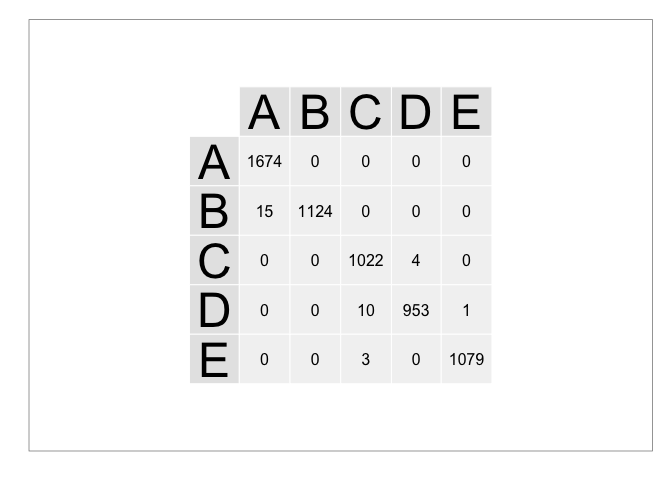

# Predictive Activity Classification of Weight Lifting Exercises
January 23, 2015  
### Overview   
Using devices such as Jawbone Up, Nike FuelBand, and Fitbit it is now possible to collect a large amount of data about personal activity relatively inexpensively. These type of devices are part of the quantified self movement – a group of enthusiasts who take measurements about themselves regularly to improve their health, to find patterns in their behavior, or because they are tech geeks. One thing that people regularly do is quantify how much of a particular activity they do, but they rarely quantify how well they do it. In this project, our goal is to use data from accelerometers on the belt, forearm, arm, and dumbbell of 6 participants to classify weight lifting exercise in 5 different ways. More information is available from the website here: <http://groupware.les.inf.puc-rio.br/har> (see the section on the Weight Lifting Exercise Dataset). 


###Data analysis and preprocessing   

Loading raw data:

```r
trnA <- read.table("../data/pml-training.csv", 
                   header = TRUE, 
                   sep = ",",
                   fill = TRUE, 
                   stringsAsFactors = FALSE)

tstA <- read.table("../data/pml-testing.csv", 
                   header = TRUE, 
                   sep = ",",
                   fill = TRUE, 
                   stringsAsFactors = FALSE)

trnA$classe <- as.factor(trnA$classe)
```

Training data set contains 19622 observations of 160 features.
Analysis of the raw data we decided to first 7 columns that contain row number, user name, raw time stamps, window indicator and window number


```r
trn <- trnA[, -(1:7)]
tst <- tstA[, -(1:7)]
```
Further analysis of the data reviews many features containing large quantities of NAs

```r
nas <- apply(trn[1:(ncol(trn)-1)], 2, function(x){mean(is.na(suppressWarnings(as.numeric(x))))})
```
 

As you can see form the plot, there are two classes of features - ones that contain no NAs(52) and others that almost all NAs(100). For the purpose of building the predictive model we will reduce our data set only to features that have no NAs across observations.


```r
trn <- trn[, !(nas > 0)]
tst <- tst[, !(nas > 0)]
```

#####Data transformations
Subsequent analysis of the remaining features across training set observations reviled s significant number of features with greater than 1 absolute value of skewness:


```r
skewVals <- apply(trn[, -ncol(trn)], 2, skewness)
sort(skewVals[abs(skewVals)>1], decreasing = TRUE)
```

```
##  gyros_dumbbell_z   gyros_forearm_z   gyros_forearm_y  gyros_dumbbell_y 
##        135.953437        116.076194         51.323792         31.648274 
## magnet_dumbbell_x     magnet_belt_x        pitch_belt      magnet_arm_z 
##          1.694024          1.433152         -1.001514         -1.140362 
##  magnet_forearm_z magnet_dumbbell_y   gyros_forearm_x     magnet_belt_y 
##         -1.221061         -1.809787         -1.923786         -2.235841 
##  gyros_dumbbell_x 
##       -126.321221
```

Unfortunately no suitable data transformation was identified to reduce the skewness of the data. Neither `log` nor `BoxCox` transformations are applicable for where values are negative. `expoTrans` transformation resulted in some `Inf` values across several predictors.

#####Data filtering
We have analyzed for near zero variance across the features to find none:


```r
nearZeroVar(trn)
```

```
## integer(0)
```

We have identified and removed highly correlated feature fromt the data sets resulting in only 45 predictors to be used to classify the activities.


```r
high.cor <- findCorrelation(cor(trn[, -ncol(trn)]), 0.90)
trn <- trn[, -high.cor]
tst <- tst[, -high.cor]
ncol(trn)-1
```

```
## [1] 45
```

###Model training, selection and validation

Remaining data set was split in training and validation set. We have evaluated two different modeling approaches - Generalized Boosted Regression Modeling and Classification and Regression with Random Forest. We used Accuracy as the metric to select best modeling approaches and tune model parameters to minimize predicted out of sample error. We used validation data set to test Out Of Sample Error for the final selection of the model to use for prediction.


```r
inTrain    <- createDataPartition(y = trn$classe, p = 0.70, list = FALSE)
training   <- trn[inTrain,]
validation <- trn[-inTrain,]
```

####Stochastic Gradient Boosting

First we have evaluated gradient boosted trees algorithm against the data set using 10 fold cross validation resampling to tune model parameters.


```r
registerDoMC(cores = 8)
set.seed(420)
trc <- trainControl(method = "cv")
modFitGBM  <- train(classe ~ ., data=training, trControl=trc, method="gbm", verbose=FALSE)
modFitGBM
```

```
## Stochastic Gradient Boosting 
## 
## 13737 samples
##    45 predictor
##     5 classes: 'A', 'B', 'C', 'D', 'E' 
## 
## No pre-processing
## Resampling: Cross-Validated (10 fold) 
## 
## Summary of sample sizes: 12364, 12364, 12364, 12363, 12363, 12362, ... 
## 
## Resampling results across tuning parameters:
## 
##   interaction.depth  n.trees  Accuracy   Kappa      Accuracy SD
##   1                   50      0.7388093  0.6688121  0.009222788
##   1                  100      0.8106601  0.7603385  0.009807510
##   1                  150      0.8445839  0.8032897  0.011474739
##   2                   50      0.8519354  0.8124143  0.010991971
##   2                  100      0.9028191  0.8769797  0.007214177
##   2                  150      0.9272774  0.9079586  0.004038028
##   3                   50      0.8892791  0.8598097  0.010736058
##   3                  100      0.9389979  0.9228036  0.006333126
##   3                  150      0.9587253  0.9477808  0.005084631
##   Kappa SD   
##   0.011595501
##   0.012469188
##   0.014511536
##   0.013911773
##   0.009088384
##   0.005081939
##   0.013534817
##   0.008007336
##   0.006433063
## 
## Tuning parameter 'shrinkage' was held constant at a value of 0.1
## Accuracy was used to select the optimal model using  the largest value.
## The final values used for the model were n.trees = 150,
##  interaction.depth = 3 and shrinkage = 0.1.
```

```r
modFitGBM$finalModel
```

```
## A gradient boosted model with multinomial loss function.
## 150 iterations were performed.
## There were 45 predictors of which 39 had non-zero influence.
```

Final model accuracy was about 95.8% with estimated  slightly over 4% predicted out of sample error. Testing the model against the validation set confirmed the estimate:


```r
confusionMatrix(validation$classe, predict(modFitGBM, newdata=validation))$overall
```

```
##       Accuracy          Kappa  AccuracyLower  AccuracyUpper   AccuracyNull 
##      0.9626168      0.9526842      0.9574504      0.9673178      0.2898895 
## AccuracyPValue  McnemarPValue 
##      0.0000000            NaN
```

Prediction vs Response count:   
 

As you can see from the table above gradient boosting model has significant misclassification error.

#####Random Forrest

We have evaluated Breiman's random forest algorithm against the data set using 10 fold cross validation resampling to tune model parameters.


```r
registerDoMC(cores = 8)
set.seed(420)
trc <- trainControl(method = "cv")
modFitRF <- train(classe ~ ., data=training, trControl=trc, method="rf")
modFitRF
```

```
## Random Forest 
## 
## 13737 samples
##    45 predictor
##     5 classes: 'A', 'B', 'C', 'D', 'E' 
## 
## No pre-processing
## Resampling: Cross-Validated (10 fold) 
## 
## Summary of sample sizes: 12364, 12364, 12364, 12363, 12363, 12362, ... 
## 
## Resampling results across tuning parameters:
## 
##   mtry  Accuracy   Kappa      Accuracy SD  Kappa SD   
##    2    0.9908275  0.9883952  0.003436780  0.004348216
##   23    0.9912646  0.9889481  0.003069595  0.003884756
##   45    0.9864594  0.9828656  0.006710390  0.008495591
## 
## Accuracy was used to select the optimal model using  the largest value.
## The final value used for the model was mtry = 23.
```

```r
modFitRF$finalModel
```

```
## 
## Call:
##  randomForest(x = x, y = y, mtry = param$mtry) 
##                Type of random forest: classification
##                      Number of trees: 500
## No. of variables tried at each split: 23
## 
##         OOB estimate of  error rate: 0.67%
## Confusion matrix:
##      A    B    C    D    E class.error
## A 3901    2    1    0    2 0.001280082
## B   26 2621   11    0    0 0.013920241
## C    0   13 2376    7    0 0.008347245
## D    0    1   20 2229    2 0.010213144
## E    0    0    3    4 2518 0.002772277
```

Final model accuracy was about 99.3% with estimated 0.7% predicted out of sample error. Testing the model against the validation set confirmed the estimate.


```r
confusionMatrix(validation$class, predict(modFitRF, newdata=validation))$overall
```

```
##       Accuracy          Kappa  AccuracyLower  AccuracyUpper   AccuracyNull 
##      0.9943925      0.9929051      0.9921340      0.9961370      0.2870008 
## AccuracyPValue  McnemarPValue 
##      0.0000000            NaN
```

Perdition vs Response count:   
 

###Conclusion
We found that Random Forrest model results in significantly smaller out of sample error on the validation data set - 0.6% vs 4%. Random Forest based fit was selected for our final model to run on the test data set. As result, the accuracy on the test data set was 20/20 - 100%.

###References
Velloso, E.; Bulling, A.; Gellersen, H.; Ugulino, W.; Fuks, H. Qualitative Activity Recognition of Weight Lifting Exercises. Proceedings of 4th International Conference in Cooperation with SIGCHI (Augmented Human '13) . Stuttgart, Germany: ACM SIGCHI, 2013.
